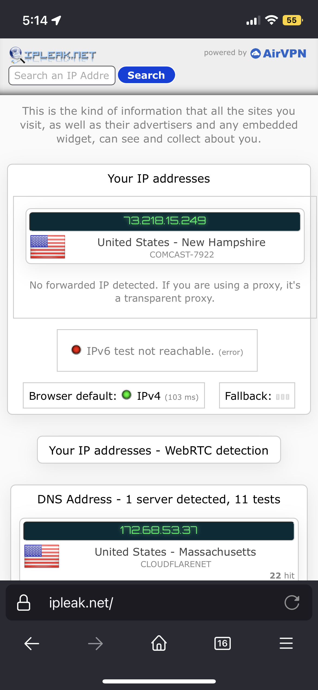
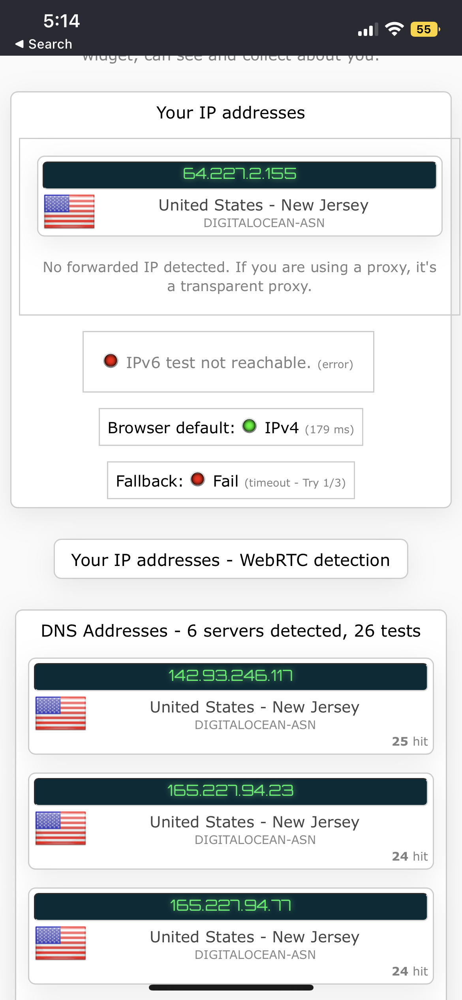
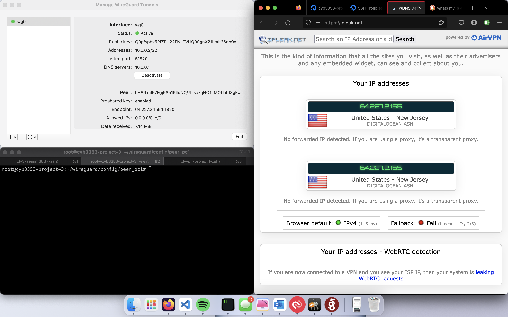

# cloud-vpn-project
This documentation will demonstrate how to set up a simple vpn using Digital Ocean and Docker. 

## (1) Set up droplet
Go to [Digital Ocean's Website](digitalocean.com) and log in to your account.

If this is your first time using the site, it will navigate you through the basic steps of setting up your first droplet.

You should choose the following droplet: 
- Ubuntu 20.4 (LTS)
- Basic
- Regular CPU

This will be the minimum droplet needed for your personal VPN, however you can choose optional add-ons and upgrades if you would like. You will notice that there are newer Ubuntu droplets, however we choose the latest LTS droplet because it is the most likely to be reliable and have the fewest bugs. 

## (2) SSH into your droplet's CLI
There are two main ways to access your droplet's CLI:
**SSH** or **Web Interface**
### (2.1) Option 1: SSH
If you choose to ssh into the droplet from your terminal like I did, then all you will need is your droplet's IP address, username, and password/ssh key. This option is better if you are more interested in developing your skills with command line utilities.

Digital Ocean's website will walk you through creating your first ssh key if you choose this option, but it is two simple steps. 

#### (2.1.1) Generate ssh keys
Run the following command in your terminal.
```zsh
ssh-keygen
```
It will ask you where you want to store the keys and you can specify a directory. 

You will notice that `ssh-keygen` will output two keys. One is a public key and the other is your personal private key. The public is the key with the suffix `.pub`. You will want to output the contents of the public key. 
```zsh
cat /path/to/key.pub
```
Copy and paste this public key into the box when prompted by Digital Ocean
#### (2.1.2) Use keys
Your droplet will have a public ip address. You will ssh into your droplet by using this IP and the root user account. To specify that you want to login using your ssh-key, you will use `-i`. 

```zsh
ssh root@<ipaddress> -i path/to/ssh-key
```

### (2.2) Option 2: Use the web interface
This option is way easier, and is a better choice if you are just looking to get the vpn as fast as possible.

In the top left of the dashboard, there will be a button that says `console`. If you click that, a virtual CLI will come up and give you access to your machine. 

## (3) Configuring your droplet
### (3.1) Installing docker

Ensure your Ubuntu OS so that it is up to date:
```
apt update
apt upgrade
```

Install tools:
```
apt install apt-transport-https ca-certificates curl software-properties-common -y
```
Download keys:
```
curl -fsSL https://download.docker.com/linux/ubuntu/gpg | sudo apt-key add -
```
Add a docker repository: (I chose the 64bit OS one)
```
add-apt-repository \
   "deb [arch=amd64] https://download.docker.com/linux/ubuntu \
   $(lsb_release -cs) \
   stable"
```
Switch to new repository:
```
apt-cache policy docker-ce
```
Install docker:
```
apt install docker-ce -y
```
Install docker-compose:
```
curl -L "https://github.com/docker/compose/releases/download/1.27.4/docker-compose-$(uname -s)-$(uname -m)" -o /usr/local/bin/docker-compose
```
Change permissions for docker-compose:
```
chmod u+x /usr/local/bin/docker-compose
```

### (3.2) Installing wireguard

Make a `config` directory:
```
mkdir -p ~/wireguard/config/
```
Make your `docker-compose` file:
```
nano ~/wireguard/docker-compose.yml
```
Add the following lines:
```
version: '3.8'
services:
  wireguard:
    container_name: wireguard
    image: linuxserver/wireguard
    environment:
      - PUID=1000
      - PGID=1000
      - TZ=America/New York
      - SERVERURL=1.2.3.4
      - SERVERPORT=51820
      - PEERS=phone,laptop
      - PEERDNS=auto
      - INTERNAL_SUBNET=10.0.0.0
    ports:
      - 51820:51820/udp
    volumes:
      - type: bind
        source: ./config/
        target: /config/
      - type: bind
        source: /lib/modules
        target: /lib/modules
    restart: always
    cap_add:
      - NET_ADMIN
      - SYS_MODULE
    sysctls:
      - net.ipv4.conf.all.src_valid_mark=1
```
> Important!
> You will need to update the `SERVERURL` to be your
> server's IP address.

Ensure you are in the wireguard directory:
```
cd ~/wireguard
```
Start wireguard:
```
docker-compose up -d
```

## (4) Connecting to wireguard

### (4.1) Connecting mobile device
You can get scannable QR codes to connect your mobile device to wireguard. All you need to do is have wireguard installed on your phone and then open up the app and click on the plus sign. It will give you the option to scan a QR code. Run the following line in your terminal to get your code and scan it. 

```
docker-compose logs -f wireguard
```

#### Before Connecting


#### After Connecting


### (4.2) Connecting your laptop
Connecting a laptop requires a bit more work.

First in your server's terminal, navigate to your wireguard config directory:
```
cd ~/wireguard/config
```
Display all your configuration info:
```
ls
```
Navigate into one of your device folders. These folders may varying in name depending on what you named your "peers" in your docker-compose file. 

You will find a `.conf` file (if you used the default docker-compose file then it will probably be `peer_pc2.conf`) 

Copy the contents of that file into a `.conf` file on your local device. 

Open up wireguard on your local machine and select import tunnel from file. Use the file you just created to import the tunnel. 

As you can see from the following screenshots, connecting to the vpn will mask your IP.
#### Before Connecting

#### After Connecting
